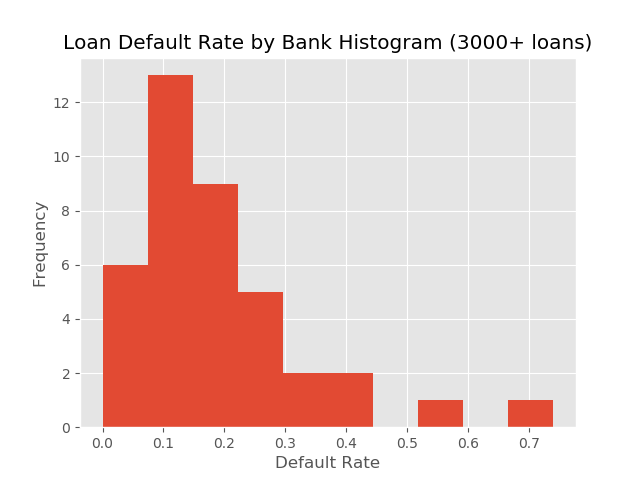
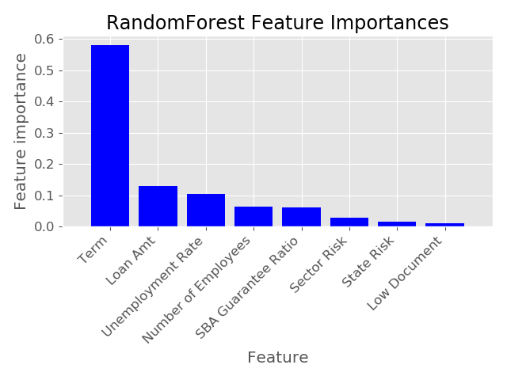
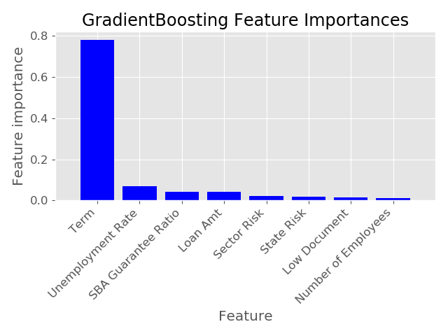
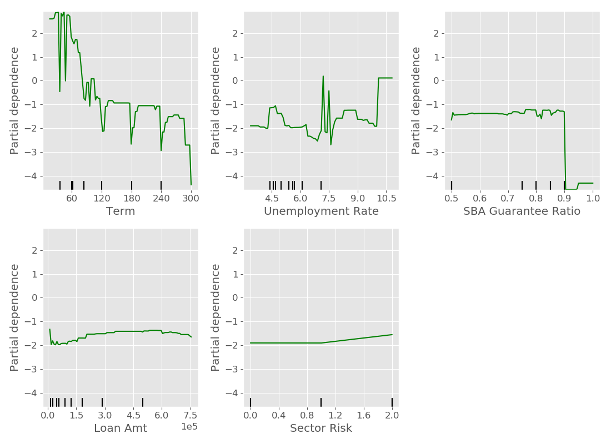

# Table of Contents
1. [Background & Motivation](#background)
2. [Data](#data)
3. [EDA & Feature Engineering](#eda)
   1. [Location(State)](#state)
   2. [Sector](#sector)
   3. [Bank(Lender)](#bank)
   4. [Business Characteristics](#business)
   5. [Loan Characteristics](#loan)
4. [Sampling, Modeling & Comparison](#model)
   1. [Sampling](#sample)
   2. [Modeling & Comparison](#compare)
   3. [Final Model](#final)
5. [Conclusion](#result)

## 1. Background & Motivation 

The U.S. Small Business Administration (SBA) is a United States government agency that provides support to entrepreneurs and small businesses.  The agency was founded on July 30, 1953 with the primary goals of promoting and assisting small enterprises in the U.S.  In the United States, small businesses have been a primary source of innovation and job creation.  According to a [JP Morgan report](https://www.jpmorganchase.com/corporate/institute/small-business-economic.htm), small businesses accounted for over half (51.2%) of the net job creation in 2014, and 48% of US overall employment as of 2014.   

One way the SBA provides assistance to small businesses is to provide easier access to the capital market and funding.  The agency doesn't extend loans directly.  Instead, it offers a loan guarantee program that is designed to encourage banks to grant commercial loans to small businesses.  In this regard, SMA acts much like an insurance provider to mitigate the risks for banks by shouldering some of the default risks.  Because SBA only guarantees a portion of the entire loan amount, banks who grant the loan will incur some losses if a small business defaults on its SBA-guaranteed loan.  As such, banks still need to evaluate the loan application and decide if they should grant it or not. 

We are in the middle of the pandemic Covid-19.  It has brought sudden and significant threats not only to human health at the risk of overcrowding the medical system but also to normal economic operations when people stay at home to "flatten the curve".  Many small businesses are suffering.  On April 21, 2020, the U.S. Senate approved a $484 billion coronavirus relief package that would provide loans to distressed small businesses.  These loans are administered by commercial banks as the "Paycheck Protection Program (PPP) loans".  In this study, I would like to build models on historical SBA guaranteed loans.  My goal is to identify the key risk factors that differentiate high-risk loans (resulting in default) from low-risk loans (with full repayments). 

## 2. Data 

I found the dataset on kaggle.com, though it originally came from the U.S. SBA.  It contains historical data from 1968 to 2014 (899,164 observations in total).  The variable name, the data type and a brief description of each variable is found in the below table:

| Variable name     | Data type | Description of variable                               |
|-------------------|-----------|-------------------------------------------------------|
| LoanNr_ChkDgt     | Text      | Loan identifier - Primary key                         |
| Name              | Text      | Borrower name                                         |
| City              | Text      | Borrower city                                         |
| State             | Text      | Borrower state                                        |
| Zip               | Text      | Borrower zip code                                     |
| Bank              | Text      | Bank (lender) name                                    |
| BankState         | Text      | Bank (lender) state                                   |
| NAICS             | Text      | North American industry classification system code    |
| ApprovalDate      | Date/Time | Date SBA approved the loan                            |
| ApprovalFY        | Text      | Fiscal year of loan commitment                        |
| Term              | Integer   | Loan term in months                                   |
| NoEmp             | Integer   | Number of business employees                          |
| NewExist          | Text      | 1=Existing business, 2=New business                   |
| CreateJob         | Integer   | Number of jobs created                                |
| RetainedJob       | Integer   | Number of jobs retained                               |
| FranchiseCode     | Text      | Franchise code, (00000 or 00001) = No franchise       |
| UrbanRural        | Text      | 1=Urban, 2=rural, 0=undefined                         |
| RevLineCr         | Text      | Revolving line of credit: Y=Yes, N=No                 |
| LowDoc            | Text      | LowDoc Loan Program: Y=Yes, N=No                      |
| ChgOffDate        | Date/Time | The date when a loan is declared to be in default     |
| DisbursementDate  | Date/Time | Loan disbursement date                                |
| DisbursementGross | Currency  | Gross loan amount disburse                            |
| BalanceGross      | Currency  | Gross amount outstanding                              |
| MIS_Status        | Text      | Loan status: charged off = CHGOFF, Paid in full = PIF |
| ChgOffPrinGr      | Currency  | Charged-off amount                                    |
| GrAppv            | Currency  | Gross amount of loan approved by bank (lender)        |
| SBA_Appv          | Currency  | SBA's guaranteed amount of approved loan              |

The following actions are taken to transform the data:

* __NAICS__ (North American Industry Classification System):  This is a 2- through 6-digit hierachical classfication system used by the Federal agencies to classify business establishments for the purpose of statiscial collection, analysis, and presentation of data.  The first two digits of NAICS represents the economic sector.  Even though the original data contains the 6-digit code (with many missing values), efforts are taken to reduce the code to the first two digits, therefore summarizing the loans to the sector level.  The below table shows the description of the NAICS sectors, with more details found on the [U.S. Census page](https://www.census.gov/cgi-bin/sssd/naics/naicsrch?chart=2017).

   | Sector | Description                                                              |
   |--------|--------------------------------------------------------------------------|
   | 11     | Agriculture, Forestry, Fishing and Hunting                               |
   | 21     | Mining, Quarrying, and Oil and Gas Extraction                            |
   | 22     | Utilities                                                                |
   | 23     | Construction                                                             |
   | 31-33  | Manufacturing                                                            |
   | 42     | Wholesale Trade                                                          |
   | 44-45  | Retail Trade                                                             |
   | 48-49  | Transportation and Warehousing                                           |
   | 51     | Information                                                              |
   | 52     | Finance and Insurance                                                    |
   | 53     | Real Estate and Rental and Leasing                                       |
   | 54     | Professional, Scientific, and Technical Services                         |
   | 55     | Management of Companies and Enterprises                                  |
   | 56     | Administrative and Support and Waste Management and Remediation Services |
   | 61     | Educational Services                                                     |
   | 62     | Health Care and Social Assistance                                        |
   | 71     | Arts, Entertainment, and Recreation                                      |
   | 72     | Accommodation and Food Serivices                                         |
   | 81     | Other Services (except Public Administration)                            |
   | 92     | Public Administration                                                    |

* __ApprovalFY__: In the original data set, there are 18 observations with ApprovalFY='1976A'.  I am not able to find what the 'A' indicates.  I choose to convert these values to 1976, thereby collapsing these 18 data points to be with ApprovalFY='1976'.

* __Franchise__: The original data set has mixed entry for this variable.  Entries '0000' and '0001' indicate there is no franchise. Franchise codes are entered wherever franchises are involved.  I choose to convert this variable to a Boolean type with 0 indicating no franchise and 1 otherwise. 

* __NewExist__ (1=Existing Business, 2=New Business): I choose to convert this variable to a Boolean type variable __NewBiz__ with 0 indicating existing business and 1 new business. 

* __LowDoc__ (Y=Yes, N=No): SBA implemented a "LowDoc Loan" program where loans under $150,000 can be processed using just a one-page application.  This is done for the goal of processing more loans efficiently.  I choose to convert this variable to a Boolean type variable __LowDocu__ where original values of '0' or 'N' corresponds to 0 and original values of '1' or 'Y' corresponds to 1. 

* __MIS_Status__: This is the target variable that we are interested in.  I choose to convert the variable to a Boolean type variable __Default__ where 1=CHGOFF and 0=PIF. 

* __Currency_Variables__:  The original data variables with type = 'Currency' are formated in the accounting convention with "$" and "," separators. These are converted to the float data type. 

* __SBA Guaranteed Portion__:  The original dataset contains the gross loan amount and the SBA guaranteed amount.  I choose to divide the latter by the former to obtain a new variable __SBA_g__ which is the percent of loan that is guanranteed by SBA.  It is a variable with values between 0 and 1.

* __U.S. Unemployment Rate__:  The final variable which isn't contained in the original SBA loan dataset is the U.S. unemployment rate, a monthly data series obtained from from the U.S. [Bureau of Labor Statistics](https://data.bls.gov/timeseries/LNS14000000). It is introduced as a proxy for where the U.S. economy stands during an economic cycle.  The unemployment rate data is merged with the SBA loan data on the loan approval date.  The thought behind this is loans issued during bad economic times (with high unemployment rate) can have higher default risk and vice versa. Below is a plot of the unemployment rate during 1965.01-2020.04.  Admittedly our SBA loan data ends roughly at mid 2014.

## 3. EDA & Feature Engineering 

Which explanatory variables may be good predicators of whether a loan will go into default or not?  This section uses data exploratory analysis to investigate and gather useful features for the predicative model.  

### 3.1. Location (State) 

Location (in this case State) can be a possible indicator for potential loan risk.  The 50 states and Washington DC have different economic environments and industry concentration, therefore leading to different default rates.  As shown by the heat map below, loan default rates definitely vary across states with Florida leading the pack at around 27.4%.  This could be explained by Florida suffering more from the boom and bust of real estate cycles, as well as more natural disaters like hurricanes.  In contrast, western states like Montana and Wyoming have lower loan default rates (in the 6% range).  This could be because these states traditionally relies on the oil and mineral industries which were more or less stable during the sample periods.     

### 3.2. Sector 

The below bar charts shows the top 10 highest loan default sectors.  Cross-referencing the sector NAICS table above, we can see that __sector 53__ is "Real estate and rental and leasing".  Real estate secotor is pro-cyclical and tends to overshoot in both economic booms and busts.  Since 1980, the United States has experienced at least two big real-estate led economic cycles, the most recent being the 2008-2009 financial crisis.  On the other of the spectrum, __sector 11__ (Agriculture, forestry, fishing and hunting), __sector 21__ (Mining, quarring, and oil and gas extraction), __sector 55__ (Management), and __sector 62__ (Health care and social assistance) suffer from lower loan default risks (in the 10% range) either because the sector is acyclical or hasn't experienced significant downward price adjustments.  (The same cannot be said about oil and gas industry in the Covid-19 Crisis, though the cause is not the virus alone.) 

### 3.3. Bank (Lender) 

Banking is an industry with high regulations.  Typically commercial banks have long established guidance to assess loan risks.  Therefore we wouldn't expect the commercial bank or which state the bank resides in has any impact on the loan default rates, unless the bank is not following the regulatory rules.  Since there are many banking/credit union entities in the data set, most of issue less than 1000 loans.  I choose to plot two histograms of all banks extending 1000+ or 3000+ loans, see below charts.  As expected, we can't make the association that banks with more loans issued have lower / higher default rates.   

### 3.4. Business Characteristics 

The SBA dataset contains some business characteristics that might be influential in the performance of loans.  Specifically, 
* New business? - the assumption is established business have a proven record of success with longer-term customers, operation workflow, etc.  In contrast new businesses are unproven and might not weather economic ups and downs as well.  However, calculated data indicates otherwise:

|              | New Biz | Established Biz |
|--------------|--------:|----------------:|
| Default Rate |  18.60% |          17.11% |

* Franchised? - similar to the new business, one can argue that business with a franchised model might have a lower risk to default on loans.  This is because franchised businesses tend to have established business plans, target clientiles, smoothed supply chains, etc.  Yet the calculated data indicates otherwise:

|              | Franchise | Non-Franchise |
|--------------|----------:|--------------:|
| Default Rate |    15.16% |        17.68% |

* Number of Employees? - below is a quartile table. It seems that Non-default loans have slightly more employees.  Perhaps bigger in size? 

| Quartiles    | Default | Non-Default |
|--------------|--------:|------------:|
| 100% maximum |    9999 |        9999 |
| 75% quartile |       7 |          11 |
| 50% median   |       3 |           5 |
| 25% quartile |       2 |           2 |
| Minimum      |       0 |           0 |

### 3.5. Loan Characteristics 

Other variables relate more to the loan characteristics. Below are some comparisons of the quantiles for loans ending in default v.s. non-default. 

__Loan Gross Disbursement__ - Non-default loans seem to have higher notional amounts.
| Quartiles    |    Default | Non-Default |
|--------------|-----------:|------------:|
| 100% maximum | $4,362,157 | $11,446,325 |
| 75% quartile |   $140,417 |    $256,686 |
| 50% median   |    $62,000 |    $100,000 |
| 25% quartile |    $28,055 |     $49,000 |
| Minimum      |     $4,000 |      $4,000 |

__Loan Term (months)__ - Non-default loans seem to be longer in term. 
| Quartiles    | Default | Non-Default |
|--------------|--------:|------------:|
| 100% maximum |     461 | $11,446,325 |
| 75% quartile |      68 |         180 |
| 50% median   |      49 |          84 |
| 25% quartile |      29 |          78 |
| Minimum      |       0 |           0 |

__SBA Guarantee Portion (%)__ - Non-default loans seem to have marginally higher percentage of SBA guarantee. 
| Quartiles    | Default | Non-Default |
|--------------|--------:|------------:|
| 100% maximum |     100 |         100 |
| 75% quartile |      82 |          85 |
| 50% median   |      50 |          75 |
| 25% quartile |      50 |          50 |
| Minimum      |      12 |         2.8 |

__Default_by_LowDocu__ - Counter-intuitively, loans with less documentation actually have lower default rate. 
|              | LowDocu   | Non-LowDocu   |
|--------------|----------:|--------------:|
| Default Rate |    9.00%  |        18.74% |

Based on these data exploration, we can draw initial conclusions that loans with higher gross disbursement dollar amounts, longer loan terms and higher SBA guarantee ratios tend to have lower default risk.  This could be explained by that businesses getting these types of loans are more established, bigger in operation sizes, or have other collaterals posted(e.g. real estates).

With the initial data EDA, I made the choice to select the following variables to model loan default risk: 
* StateRisk
* SectorRisk
* LoanTerm(Term)
* Number of Employees(NumEmp)
* LowDocu
* Gross_Approval_Amt(GrAppv)
* SBA_Guaranteed_Ratio(SBA_g)
* Unemployment(U_rate)  

For StateRisk and SectorRisk, additional bucketing is done to convert the variables into numeric values.  For StateRisk, any state with a default rate higher than 18%(inclusive) is categorized as high risk (value=2). States with default rate between 10% and 18%(not inclusive) are rated 1 and those with default rate lower than 10% are rated 0.  For SectorRisk, ratings are similarly chosen amongst 0, 1, and 2, with the cutoff levels at default rate equal to 10% or 20%. 

## 4. Sampling, Modeling & Comparison 

The ultimate goal of this study is to have a model that has good predictive power in loan defaults.  Various models are tried and this section details the steps taken and the performance comparison of various models.  

### 4.1. Sampling 

Before hopping into the modeling topic, there is one last decison to make about the dataset.  The data cleaning and feature engineering conducted in the previous two sections result in a loan dataset that has 887,382 observations.  Each observation has 9 attributes with the 9th being the loan defaulted or not.  The rest 8 attributes are the potential explanatory variables. A deeper look at the data reveals that the classes are not balanced.  The minority class (which is also the event we try to identify) takes about 20% of the 887,382 observations.  

To solve the imbalanced classes problem, two options are considered in the study:

* Use the "class_weight" option that is built in some of the sklearn models.  Setting this option to "balanced" results in an automatic weights adjustment by the inverse of class frequencies. 

* Perform resampling to balance the dataset before feeding the data to models.  Because I have enough data points for both the minority and majority classes.  I choose to undersample the majority class to arrive at a target ratio of 0.45 for the minority class. After undersampling is done, I have a dataset of 276,579 observations. 

Both of these options are tried on four types of models: Logistic Regression, Random Forest, Gradient Boosted Classifier, and AdaBoost Classifier.  The resulting model metrics on the test data are listed in the below table.  All models are run on the selected 8 explanatory variables.  

| Models              | Class_weight | Undersample |
|---------------------|-------------:|------------:|
| __Logistic Regression__ |              |             |
|    Precision        |        0.367 |       0.687 |
|    Recall           |        0.071 |       0.054 |
|    Accuracy         |        0.816 |       0.564 |
| __Random Forest__       |              |             |
|    Precision        |        0.836 |       0.895 |
|    Recall           |        0.746 |       0.879 |
|    Accuracy         |        0.930 |       0.899 |
| __Gradient Boost__      |              |             |
|    Precision        |        0.847 |       0.898 |
|    Recall           |        0.771 |       0.879 |
|    Accuracy         |        0.935 |       0.899 |
| __Ada Boost__           |              |             |
|    Precision        |        0.848 |       0.895 |
|    Recall           |        0.763 |       0.900 |
|    Accuracy         |        0.934 |       0.908 |

Comparing the model performance metrics between the two sampling options, it is easy to see that the Undersample method does matter in the great majority of cases.  Therefore this option is chosen.  Amongst the model selections, a linear model like Logistic Regression performs significantly worse than the other three non-linear models.  Out of the three non-linear models, performance is pretty much on-par with each other.  In the next modeling section, I will use both Random Forest and Gradient Boost to identify features of importance.   

### 4.2. Modeling & Comparison 

With the resampled data and original 8 features, a Random Forest model and a Gradient Boost model are fitted separately.  The goal is see if both models will identify the same set of important features

* Random Forest Model - as the below chart indicates, the most imoportant feature in predicting loan default risk is loan term ('Term'), explaining about 58% of the information gain.  This is followed by gross loan amount ('GrAppv'), the unemployment rate ('U_rate'), number of employees(NumEmp), SBA guaranteed percent('SBA_g'). 

* Gradient Boost Model - Like the Random Forest model, the most important feature is 'Term', explaining almost 76% of the information gain.  In a decreasing order, the next four important features are 'U_rate', 'GrAppv', 'SBA_g', and 'SectorRisk'.  There is actually a very good overlap between the two models. Four out of the five most important features are the same.  

The below chart shows the partial dependence plot on the first five important features for the Gradient Boost model. 

Given the feature importance study, I made a decison to further reduce the number of explanatory to five: 'Term', 'U_rate', 'GrAppv', 'SBA_g', and 'SectorRisk' and proceed with the Gradient Boost model as the final model.  A grid search is performed in hope to fine tune the hyper-parameters. 

| Parameter        | Optimal | Gridsearch Values |
|------------------|--------:|------------------:|
| learning rate    |     0.2 |  [0.2, 0.1, 0.05] |
| max_depth        |       5 |            [3, 5] |
| min_samples_leaf |      50 |         [50, 200] |
| max_features     |       3 |             [2,3] |
| n_estimators     |     500 |        [500, 300] |
| random_state     |       2 |                 2 |

### 4.3. Final Model 

A final Gradient Boost model with the optimal hyper-parameters and five explanatory variables are fit on the entire training dataset.  The fitted model is then used to predict on the X observations in the holdout set that was aside from the beginning (20% of overall data).  The performance metrics are listed below. 

| Gradient Boost Model|      Metrics | 
|---------------------|-------------:|
|    Precision        |        0.715 |
|    Recall           |        0.913 |
|    Accuracy         |        0.921 |

A final Logistic model is also fitted with the selected five explanatory variables after standardardization.  The model coefficients are as the following:

| Variable    | Intercept |  Term | U_rate | SBA_g | GrAppv | SectorRisk |
|-------------|----------:|------:|-------:|------:|-------:|-----------:|
| Coefficient |     -0.47 | -1.61 |  -0.25 |  0.03 |   0.29 |       0.29 |

Signs on variables 'Term' and 'SectorRisk' are as expected.  Longer loan terms typically requires collaterals therefore reducing default risk.  Higher sector risk leads to higher probability that a loan will go into default.  Sign on the other three variables are counter-intuitive. We would expect higher unemployment rates indicate tougher economic times, therefore leading to more loan defaults.  Bigger loan notional or SBA guaranteed ratio should result in lower default risks.  But many factors can affect this such as colinearity between the feature variables.  Ultimately the relationship between the loan default and explanatory variables is non-linear.

## 5. Conclusion 

The loan default classifier was trained on the undersampled training dataset of ~277,000 loans and tested on the holdout test set of ~177,500.  The model performance has been satisfactory with 92.1% overall accuracy.  Precision rate dropped from the 90% range in the training/test set to 71.5%.  I realized at the end of day that I should have resampled the overall dataset first before taking the holdout set.  This will be done in the next round of model iteration. 