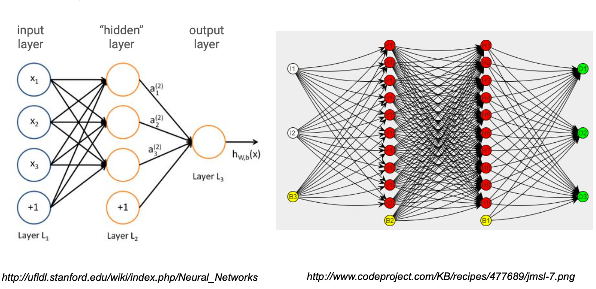
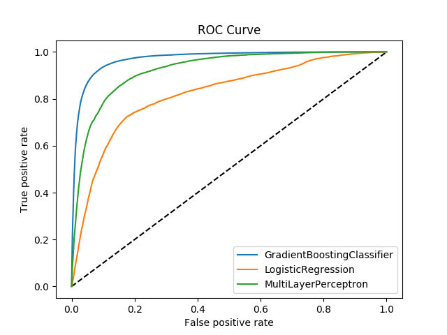
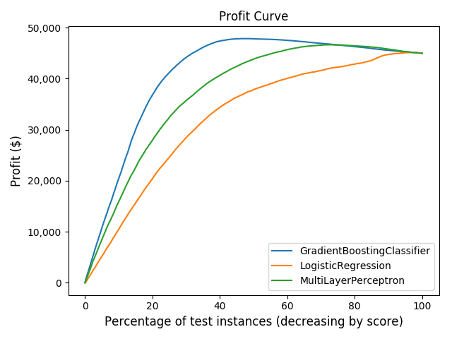

# Table of Contents
1. [Background & Motivation](#background)
2. [Data](#data)
3. [EDA & Feature Engineering](#eda)
   1. [Location(State)](#state)
   2. [Sector](#sector)
   3. [Bank(Lender)](#bank)
   4. [Business Characteristics](#business)
   5. [Loan Characteristics](#loan)
4. [Sampling, Modeling & Comparison](#model)
   1. [Balancing Classes](#sample)
   2. [Ensemble Models](#gbc)
   3. [Multi-layer Perceptron (MLP) Model](#mlp)
   4. [Model Performance - ROC and Profit Curves](#profit)
   5. [Final Model](#final)
5. [Conclusion](#result)
6. [Citation](#cite)

## 1. Background & Motivation 

The U.S. Small Business Administration (SBA) is a United States government agency that provides support to entrepreneurs and small businesses.  The agency was founded on July 30, 1953 with the primary goals of promoting and assisting small enterprises in the U.S.  In the United States, small businesses have been a primary source of innovation and job creation.  According to a [JP Morgan report](https://www.jpmorganchase.com/corporate/institute/small-business-economic.htm), small businesses accounted for over half (51.2%) of the net job creation in 2014, and 48% of US overall employment as of 2014.   

One way the SBA provides assistance to small businesses is to provide easier access to the capital market and funding.  The agency doesn't extend loans directly.  Instead, it offers a loan guarantee program that is designed to encourage banks to grant commercial loans to small businesses.  In this regard, SMA acts much like an insurance provider to mitigate the risks for banks by shouldering some of the default risks.  Because SBA only guarantees a portion of the entire loan amount, banks who grant the loan will incur some losses if a small business defaults on its SBA-guaranteed loan.  As such, banks still need to evaluate the loan application and decide if they should grant it or not. 

We are in the midst of the pandemic Covid-19.  It has brought sudden and significant threats not only to human health but also to normal economic operations when people stay at home to "flatten the curve".  Many small businesses are suffering.  The Coronavirus Aid, Relief, and Economic Secuirty (CARES) Act was passed by Congress and signed into law by the president on March 27, 2020.  The core of CARES Act is to provide loans to small business owners in maintaining payroll.  The initial tranche of $349 billion in funding was quickly exghausted in merely 13 days.  A second tranche of $310 billion was added on April 23, 2020.  As of June 6, more than 4.42 million loans worth roughly $510 billion had been distributed through the program, leaving roughly $100 billion remaining in the fund. PPP loans are forgiveable if used within guidance. 

This made me wonder - how did SBA loans perform historically?  Some initial investigation shows that one in six SBA guaranteed commercial loans actually ended up in default.  In this study, I would like to research what factors are primary in predicting if a loan will go into default.  I would also like to build a model that can help the banker in making the decision of what SBA loan applications to approve.  

## 2. Data 

I found the dataset on kaggle.com, though the origin is the U.S. SBA office.  It contains historical SBA loan data from 1968 to mid-2014 (899,164 observations in total).  The variable name, the data type and a brief description of each variable is found in the table below:

| Variable name     | Data type | Description of variable                               |
|-------------------|-----------|-------------------------------------------------------|
| LoanNr_ChkDgt     | Text      | Loan identifier - Primary key                         |
| Name              | Text      | Borrower name                                         |
| City              | Text      | Borrower city                                         |
| State             | Text      | Borrower state                                        |
| Zip               | Text      | Borrower zip code                                     |
| Bank              | Text      | Bank (lender) name                                    |
| BankState         | Text      | Bank (lender) state                                   |
| NAICS             | Text      | North American industry classification system code    |
| ApprovalDate      | Date/Time | Date SBA approved the loan                            |
| ApprovalFY        | Text      | Fiscal year of loan commitment                        |
| Term              | Integer   | Loan term in months                                   |
| NoEmp             | Integer   | Number of business employees                          |
| NewExist          | Text      | 1=Existing business, 2=New business                   |
| CreateJob         | Integer   | Number of jobs created                                |
| RetainedJob       | Integer   | Number of jobs retained                               |
| FranchiseCode     | Text      | Franchise code, (00000 or 00001) = No franchise       |
| UrbanRural        | Text      | 1=Urban, 2=rural, 0=undefined                         |
| RevLineCr         | Text      | Revolving line of credit: Y=Yes, N=No                 |
| LowDoc            | Text      | LowDoc Loan Program: Y=Yes, N=No                      |
| ChgOffDate        | Date/Time | The date when a loan is declared to be in default     |
| DisbursementDate  | Date/Time | Loan disbursement date                                |
| DisbursementGross | Currency  | Gross loan amount disburse                            |
| BalanceGross      | Currency  | Gross amount outstanding                              |
| MIS_Status        | Text      | Loan status: charged off = CHGOFF, Paid in full = PIF |
| ChgOffPrinGr      | Currency  | Charged-off amount                                    |
| GrAppv            | Currency  | Gross amount of loan approved by bank (lender)        |
| SBA_Appv          | Currency  | SBA's guaranteed amount of approved loan              |

The following actions are taken to transform the data:

* __NAICS__ (North American Industry Classification System):  This is a 2- through 6-digit hierachical classfication system used by the Federal agencies to classify business establishments for the purpose of statiscial collection, analysis, and presentation of data.  The first two digits of NAICS represents the economic sector.  Even though the original data contains the 6-digit code (with many missing values), efforts are taken to reduce the code to the first two digits, therefore summarizing the loans to the sector level.  The below table shows the description of the NAICS sectors, with more details found on the [U.S. Census page](https://www.census.gov/cgi-bin/sssd/naics/naicsrch?chart=2017).

   | Sector | Description                                                              |
   |--------|--------------------------------------------------------------------------|
   | 11     | Agriculture, Forestry, Fishing and Hunting                               |
   | 21     | Mining, Quarrying, and Oil and Gas Extraction                            |
   | 22     | Utilities                                                                |
   | 23     | Construction                                                             |
   | 31-33  | Manufacturing                                                            |
   | 42     | Wholesale Trade                                                          |
   | 44-45  | Retail Trade                                                             |
   | 48-49  | Transportation and Warehousing                                           |
   | 51     | Information                                                              |
   | 52     | Finance and Insurance                                                    |
   | 53     | Real Estate and Rental and Leasing                                       |
   | 54     | Professional, Scientific, and Technical Services                         |
   | 55     | Management of Companies and Enterprises                                  |
   | 56     | Administrative and Support and Waste Management and Remediation Services |
   | 61     | Educational Services                                                     |
   | 62     | Health Care and Social Assistance                                        |
   | 71     | Arts, Entertainment, and Recreation                                      |
   | 72     | Accommodation and Food Serivices                                         |
   | 81     | Other Services (except Public Administration)                            |
   | 92     | Public Administration                                                    |

* __ApprovalFY__: In the original data set, there are 18 observations with ApprovalFY='1976A'.  I am not able to find what the 'A' indicates.  I choose to convert these values to 1976, thereby collapsing the 18 data points to be with ApprovalFY='1976'.

* __Franchise__: The original data set has mixed entries for this variable.  Entries '0000' and '0001' indicate there is no franchise. Franchise codes are entered wherever franchises are involved.  I choose to convert this variable to a Boolean type with 0 indicating no franchise and 1 otherwise. 

* __NewExist__ (1=Existing Business, 2=New Business): I choose to convert this variable to a Boolean type variable __NewBiz__ with 0 indicating existing business and 1 new business. 

* __LowDoc__ (Y=Yes, N=No): SBA implemented a "LowDoc Loan" program where loans under $150,000 can be processed using just a one-page application.  This is done for the goal of processing more loans efficiently.  I choose to convert this variable to a Boolean type variable __LowDocu__ where original values of '0' or 'N' corresponds to 0 and original values of '1' or 'Y' corresponds to 1. 

* __MIS_Status__: This is the target variable that we are interested in.  I choose to convert the variable to a Boolean type variable __Default__ where 1=CHGOFF and 0=PIF. 

* __Currency_Variables__:  The original data variables with type = 'Currency' are formatted in the accounting convention with "$" and "," separators. These are converted to the float data type. 

* __SBA Guaranteed Portion__:  The original dataset contains the gross loan amount and the SBA guaranteed amount.  I choose to divide the latter by the former to obtain a new variable __SBA_g__ which is the percent of loan that is guanranteed by SBA.  It is a variable with values between 0 and 1.

* __U.S. Unemployment Rate__:  The final variable which isn't contained in the original SBA loan dataset is the U.S. unemployment rate, a monthly data series obtained from from the U.S. [Bureau of Labor Statistics](https://data.bls.gov/timeseries/LNS14000000). It is introduced as a proxy for where the U.S. economy stands during an economic cycle.  The unemployment rate data is merged with the SBA loan data on the loan approval date.  The thought behind this is loans issued during bad economic times (with high unemployment rate) may have higher default risk and vice versa. Below is a plot of the unemployment rate during 1965.01-2020.04.  Admittedly our SBA loan data ends at mid-2014.

## 3. EDA & Feature Engineering 

Which explanatory variables may be good predicators of whether a loan will go into default?  This section uses data exploratory analysis to investigate and gather useful features for the predicative model.  

### 3.1. Location (State) 

Location (in this case State) can be a possible indicator for potential loan risk.  The 50 states and Washington DC have different economic environments and industry concentration, therefore leading to different default rates.  As shown by the heat map below, loan default rates definitely vary across states with Florida leading the pack at around 27.4% SBA loan defaults.  This could be explained by Florida suffering more from the boom and bust of real estate cycles, as well as more natural disaters like hurricanes.  In contrast, western states like Montana and Wyoming have lower loan default rates (in the 6% range).  This could be explained by the fact that these states traditionally relies on the oil and mineral industries which were more or less stable during the sample periods.     

### 3.2. Sector 

The below bar charts list the top five highest and bottom five lowest loan defaults by sectors.  It is clear that real estate sector has the highest SBA loan default rate at about 28%.  Real estate secotor is pro-cyclical and tends to overshoot in both economic booms and busts.  Since 1980, the United States has experienced at least two big real-estate led economic cycles, the most recent being the 2008-2009 financial crisis.  On the other side of the spectrum, sectors like "Mining, quarring, and oil and gas extraction" and "Agriculture, forestry, fishing and hunting" suffer from low loan default risks (in the 10% and under range) either because the sectors are acyclical or haven't experienced significant downward price adjustments.  (The same cannot be said about oil and gas industry in the Covid-19 Crisis, though the cause is not the virus alone.) 

### 3.3. Bank (Lender) 

Banking is an industry with high regulations.  Typically commercial banks have long established guidance to assess loan risks.  Therefore we wouldn't expect the commercial bank or the specific state that the bank resides in to have any impact on the loan default rates, unless the bank is not following the regulatory rules.  Because there are many banking/credit union entities in the data set, most of which issue less than 1000 loans.  I choose to plot two histograms of all banks extending 1000+ or 3000+ loans (see below charts).  As expected, we can't make the association that banks with more loans issued have lower / higher default rates.   

### 3.4. Business Characteristics 

The SBA dataset contains some business characteristics that might be influential in the performance of loans.  Specifically, 

* __New business__ - the assumption is that established business have a proven record of success with longer-term customers, operation workflow, etc.  In contrast new businesses are unproven and might not weather economic ups and downs as well.  However, calculated data indicates otherwise:

    |              | New Biz | Established Biz |
    |--------------|--------:|----------------:|
    | Default Rate |  18.60% |          17.11% |

* __Franchised__ - similar to the new business consideration, one might argue that business with a franchised model might have a lower risk to default on loans.  This is because franchised businesses tend to have established business plans, target clientiles, smoothed supply chains, etc.  Yet the calculated data indicates non-franchised businesses only have marginally higher default rates than their franchised couterparts.

    |              | Franchise | Non-Franchise |
    |--------------|----------:|--------------:|
    | Default Rate |    15.16% |        17.68% |

* __Number of Employees__ - below is a quartile table of comparison. It seems that Non-default loans have slightly more employees.  Perhaps bigger in size? 

    | Quartiles    | Default | Non-Default |
    |--------------|--------:|------------:|
    | 100% maximum |    9999 |        9999 |
    | 75% quartile |       7 |          11 |
    | 50% median   |       3 |           5 |
    | 25% quartile |       2 |           2 |
    | Minimum      |       0 |           0 |

### 3.5. Loan Characteristics 

The rest of variables relate more to the loan characteristics. Below are some comparisons of the quantiles for loans ending in default v.s. non-default. 

* __Loan Gross Disbursement__ - Non-default loans seem to have higher notional amounts.

    | Quartiles    |    Default | Non-Default |
    |--------------|-----------:|------------:|
    | 100% maximum | $4,362,157 | $11,446,325 |
    | 75% quartile |   $140,417 |    $256,686 |
    | 50% median   |    $62,000 |    $100,000 |
    | 25% quartile |    $28,055 |     $49,000 |
    | Minimum      |     $4,000 |      $4,000 |

* __Loan Term (months)__ - Non-default loans seem to be considerably longer in term. 

    | Quartiles    | Default | Non-Default |
    |--------------|--------:|------------:|
    | 100% maximum |     461 |         569 |
    | 75% quartile |      68 |         180 |
    | 50% median   |      49 |          84 |
    | 25% quartile |      29 |          78 |
    | Minimum      |       0 |           0 |

* __SBA Guarantee Portion (%)__ - Non-default loans seem to have higher percentage of SBA guarantee, especially for the top 50% percentile.

    | Quartiles    | Default | Non-Default |
    |--------------|--------:|------------:|
    | 100% maximum |     100 |         100 |
    | 75% quartile |      82 |          85 |
    | 50% median   |      50 |          75 |
    | 25% quartile |      50 |          50 |
    | Minimum      |      12 |         2.8 |

* __Default_by_LowDocu__ - Counter-intuitively, loans with less documentation actually have lower default rate. 

    |              | LowDocu   | Non-LowDocu   |
    |--------------|----------:|--------------:|
    | Default Rate |    9.00%  |        18.74% |

Based on these data exploration, we can draw initial conclusions that loans with higher gross dollar amounts, longer loan terms and higher SBA guarantee ratios tend to have lower default risk.  This could be explained by that businesses getting these types of loans are more established in nature, bigger in operation size, and/or have other collaterals posted(e.g. real estates).

With the initial data EDA, I made the choice to select the following variables to model loan default risk: 
* StateRisk
* SectorRisk
* LoanTerm(Term)
* Number of Employees(NumEmp)
* Low Document (LowDocu)
* Gross_Approval_Amt(GrAppv)
* SBA_Guaranteed_Ratio(SBA_g)
* Unemployment(U_rate)  

For StateRisk and SectorRisk, additional feature engineering is performed to convert the variables into numeric values.  For StateRisk, any state with a default rate higher than 18%(inclusive) is categorized as high risk (value=2). States with default rate between 10%(inclusive) and 18%(exclusive) are rated 1 and those with default rate lower than 10%(exclusive) are rated 0.  For SectorRisk, ratings are similarly chosen amongst 2, 1, and 0, with the cutoff levels at 20% and 10% respectively. 

## 4. Sampling, Modeling & Comparison 

The ultimate goal of this study is to identify a model that has good predictive power in loan defaults.  This section details the steps taken in exploring different models, the performance comparison, and the final model selection.  

### 4.1. Balancing Classes 

Before hopping into the modeling topic, there is one last decison to be made about the dataset.  The data cleaning and feature engineering conducted in the previous two sections result in a loan dataset that has 887,382 observations.  Each observation has nine attributes with the 9th being the target - whether the loan defaulted or not.  The rest eight features are the explanatory variables. A deeper look at the data reveals that the two classes (default v.s. non-default) are not balanced.  The minority class (default, which is also the event we try to identify) takes about 17.6% of the 887,382 observations.  

To solve the imbalanced classes problem, two options are evaluated in the study:

* Use the "class_weight" option that is built in some of the models.  Setting this option to "balanced" results in an automatic weights adjustment by the inverse of class frequencies. 

* Perform resampling to balance the dataset before feeding the data to the model.  Because there is enough data points for both the minority and majority classes, I choose to undersample the majority class to arrive at a target ratio of 0.45 for the minority class. After undersampling is performed, I have a dataset of 276,579 observations. 

Both of these options are tried on four types of models: Logistic Regression, Random Forest, Gradient Boosting Classifier, and AdaBoost Classifier.  The resulting model metrics on the test data are listed in the below table.  All models are run on the selected eight explanatory variables.  

 | Models              | Class_weight | Undersample |
 |---------------------|-------------:|------------:|
 | __Logistic Regression__ |              |             |
 |    Precision        |        0.367 |       0.369 |
 |    Recall           |        0.071 |       0.056 |
 |    Accuracy         |        0.816 |       0.818 |
 | __Random Forest__       |              |             |
 |    Precision        |        0.836 |       0.770 |
 |    Recall           |        0.746 |       0.994 |
 |    Accuracy         |        0.930 |       0.947 |
 | __Gradient Boosting__      |              |             |
 |    Precision        |        0.847 |       0.704 |
 |    Recall           |        0.771 |       0.904 |
 |    Accuracy         |        0.935 |       0.917 |
 | __Ada Boost__           |              |             |
 |    Precision        |        0.848 |       0.697 |
 |    Recall           |        0.763 |       0.900 |
 |    Accuracy         |        0.934 |       0.914 |

Three model performance metrics between the two sampling options are listed: __Precision__, __Recall__ and __Accuracy__.  For this study, we care first and foremost about the __Precision__ metric.  That is, we don't want to predict a loan going into default when it doesn't in fact.  Ultimately, the goal of SBA loan guarantee is to assist small business owners in obtaining much needed capital for growth. Secondly, we would also want the model to have a good overall accuracy rate after the imbalanced dataset problem is corrected.  Based on these two criteria, the class_weight option is chosen.  Amongst the model tested, a linear model like Logistic Regression performs significantly worse than the other three non-linear models.  Out of the three non-linear models, performance is pretty much on-par with each other.  In the next modeling section, I will use both Random Forest and Gradient Boosting to identify the features of importance.   

### 4.2. Ensemble Models 

With the original eight features, a Random Forest model and a Gradient Boosting model are fitted separately while setting the class_weight option to balanced.  The goal is see if both models will identify the same set of important features.

* __Random Forest Model__ - as the below chart indicates, the most imoportant feature in predicting loan default risk is the loan term, explaining about 58% of the information gain.  This is followed by the gross loan amount, the unemployment rate, the number of employees, and SBA guaranteed ratio. 

* __Gradient Boosting Model__ - Like the Random Forest model, the most important feature is the loan term, explaining almost 78% of the information gain.  In a decreasing order, the next four important features are the unemployment rate, the SBA guaranteed ratio, the gross loan amount, and the sector risk.  There is actually a very good overlap between the two models. Four out of the five most important features are the same.  

The below chart shows the partial dependence plot on the first five important features for the Gradient Boosting model. 

Given the feature importance study, I made a decison to further reduce the number of explanatory to five: the loan term(Term), the unemployment rate (U_rate), the SBA guanranteed ratio (SBA_g), the gross loan amount (GrAppv), and the sector risk (SectorRisk), and proceed with the Gradient Boosting model as the final model.  A grid search is performed in hope to fine tune the hyper-parameters. 

 | Parameter        | Optimal | Gridsearch Values |
 |------------------|--------:|------------------:|
 | learning_rate    |    0.2  |  [0.2, 0.1, 0.05] |
 | max_depth        |       5 |            [3, 5] |
 | min_samples_leaf |      50 |    [50, 100, 200] |
 | max_features     |       3 |            [2, 3] |
 | n_estimators     |     500 |        [300, 500] |
 | random_state     |       2 |                 2 |

### 4.3. Multi-layer Perceptron (MLP) Model 

Machine learning models have different characteristics.  Each has its own pro's and con's.  The Gradient Boosting Classifier is a type of ensemble model that has good predicting performance. It is also able to identify key features in projecting if a SBA loan will go into default.  Neural networks models have gained popularity in recent years.  These types of models aim at mimicking the human brain in learning and action.  However, the downside is the neural network models are not inferential.  They functions primarily as a black-box and a forecasting tool.  I thought it would be good to give neural networks models a try.  My goal is to see if added comlexity in model structure help predict defaults better. 

Multi-layer Perceptron (MLP) model is a vanilla type of neural network models.  It has been used for pattern, speech, and image recognition tasks and obtained decent results.  The below chart illustrates the MLP model structure.  In the chart, one hidden layer and one output layer are shown.  Each layer can have different number of neurons and/or activation functions.  The model weights are randomly initiated upfront.  A backpropagation process through partial differential equations and gradient descend then updates the weights in a recursive way, with the goal to minimize the loss function. 

I constructed an MLP model with an input layer, two hidden layers, and an output layer.  Each layer has 256 neurons.  A dropout layer of 30% is also added after each hidden layer to condense the feature extraction.  The output layer incurs the sigmoid function since predicting loan default is a binary classification problem. This model is uploaded to an AWS P2.xlarge instance and fine-tuned there using Tensorflow.  A standardization of features are performed before feeding them to the model.  This is not required, yet research has indicated that standardization can help the model learn.  Last but not least, class-weighting is added as the inverse of class counts.  All codes are found in the script "src/model_mlp.py". 

Contrary to my initial thought, the MLP model didn't improve overall model performance.  I will illustrate this point more in the next section. 

### 4.4. Model Performance - ROC and Profit Curves 

I have the following three competing models at this time.  Which one performs the best? 
* Logistic Regression
* Gradient Boosting Classifier
* Multi-layer Perceptron

Because all are classifiers, one way to compare them is the area under the ROC curve.  The ROC curve illustrates the trade-off between the true positive rate and the false positive rate for each level of the threshold.  The 45&deg; line represents random guessing with an area under the curve (AUC) score of 0.5.  Therefore, the bigger the total area under the ROC curve, the better the model performance.  The below chart shows the ROC curve for each of the three competing models.  As we can see, the Gradient Boosting Classifier performs the best.  

| Model                        | ROC AUC Score |
|------------------------------|--------------:|
| Logistic Regression          | 0.821         |
| Gradient Boosting Classifier | 0.971         |
| Multi-layer Perceptron       | 0.922         |

Going back to the original question - what loan(s) should the banker approve when faced with a ton of applications?  We need to introduce one more assumption to convert the model predicted default probability to dollar ($) terms.  Here I am assuming: 

* Average loan pay-off in 7 years with an interst rate of 7.5%
* If a loan were to default, it defaults roughly at 3.5 year mark
* It costs $5,000 for checking potential defaults
* All returns are normalized to $100,000 notionals in loan amounts

With these assumptions, the cost-benefit matrix looks like the following: 

And the profit curves for the three competing models: 

### 4.5. Final Model 

A final Gradient Boosting model with the optimal hyper-parameters and five explanatory variables are fit on the entire training dataset.  The fitted model is then used to predict the loan defaults on the holdout data set aside from the beginning (20% of overall data).  The performance metrics are listed below. 

| Gradient Boosting Model|      Metrics | 
|---------------------|-------------:|
|    Precision        |        0.842 |
|    Recall           |        0.805 |
|    Accuracy         |        0.939 |

A final Logistic model is also fitted with the selected five explanatory variables after standardardization.  The model coefficients are as the following:

| Variable    | Intercept |  Term | GrAppv | U_rate | SBA_g | SectorRisk |
|-------------|----------:|------:|-------:|------:|-------:|-----------:|
| Coefficient |     -2.37 | -1.95 |  0.19  | -0.31 |   0.02 |       0.34 |

Signs on variables 'Term' and 'SectorRisk' are as expected.  Longer loan terms typically requires collaterals therefore reducing default risk.  Higher sector risk leads to higher probability that a loan will go into default.  Sign on the other three variables are counter-intuitive. We would expect higher unemployment rates to indicate tougher economic times, therefore leading to more loan defaults.  Bigger loan notional or SBA guaranteed ratio should result in lower default risks.  But these parameters are small and many factors can affect the signs such as colinearity between the feature variables.  Ultimately the relationship between the loan default and explanatory variables is non-linear.

## 5. Conclusion 

The loan default classifier was trained on the training dataset of ~710,000 loans and tested on the holdout test set of ~177,500 loans.  The model performance has been satisfactory with 93.9% overall accuracy.  Precision rate dropped slightly from 84.7% in the training/test set to 84.2%.  For the hold-out set, the predicted v.s. true values are listed in the below confusion matrix:

For further research,  I would like to try other deep learning models on this dataset such as the multi-level perceptron (MLP).

## 6. Citation 
* [Small Business Administration (SBA)](https://www.sba.gov/)
* [Wells Fargo SBA Lending](https://www.wellsfargo.com/biz/sba/)
* [Should This Loan be Approved or Denied? A large and rich dataset from the U.S. Small Business Administration (SBA)](https://www.kaggle.com/mirbektoktogaraev/should-this-loan-be-approved-or-denied)